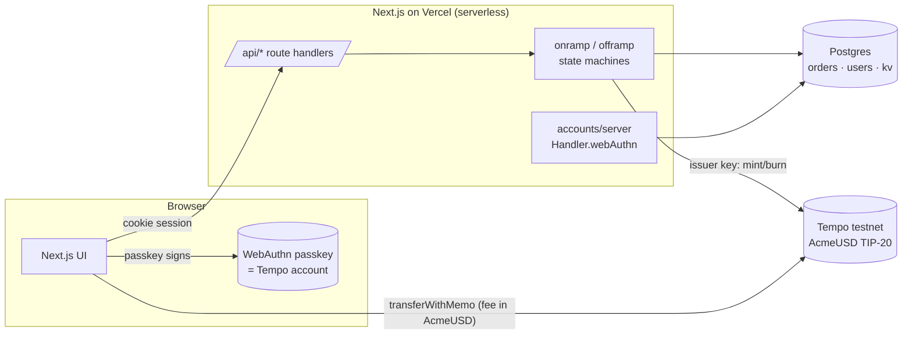

# AcmeUSD — Design Doc

**Goal.** Let ACME issue a stablecoin on Tempo and let users onramp USD → AcmeUSD, offramp back, send/receive it paying fees in AcmeUSD, with an admin view of liabilities — graded first on *not losing money*, then on being simple to operate, then UX. USD is stubbed; the chain is real (Tempo Moderato testnet).

## 1. System at a glance



- **AcmeUSD** is a TIP-20 created via Tempo's factory precompile (`currency: USD`, quote token pathUSD, 6 decimals). One secp256k1 key is both **issuer** (`ISSUER_ROLE`) and **treasury** — TIP-20 `burn` burns from `msg.sender` and requires the issuer role, so a separate treasury would just add a hop.
- **Users** are passkeys. Tempo verifies WebAuthn/P256 signatures at the protocol level, so the passkey *is* the account (address = `keccak256(pubX‖pubY)[12:]`). The same passkey ceremony (`accounts/server`) also issues the app's session cookie, so "connect wallet" and "log in" are one gesture and the server always derives the caller's address from the credential, never from the request body. A person can hold several wallets on a device — each is its own passkey (a fresh WebAuthn user handle, so authenticators don't overwrite it) with a label; the wallet page lists them (a localStorage registry mirrored from the SDK's account store, so labels survive sign-out) and creates new named ones. **Switching never prompts**: the SDK keeps every account that has connected in this browser, so a switch is a local reorder of that store (wagmi follows `accountsChanged`), and the server accepts the switched wallet because every wallet that completes a ceremony is recorded in a signed, HttpOnly `acme_wallets` cookie; API calls name the wallet they act for (`x-wallet`) and it is honoured only if it is the session's own credential or one already linked. The passkey is asked for exactly twice in a wallet's life on a device: its first sign-in, and every transaction it signs.
- **Fees**: Tempo has no gas token; fees are paid in USD stablecoins. ACME seeded the Fee AMM once (AcmeUSD → AlphaUSD and → pathUSD) so every user transaction passes `feeToken: AcmeUSD`. The issuer pays *its own* fees in pathUSD so minting never depends on the AcmeUSD pool's liquidity.
- **Ledger** is Postgres via Drizzle. Two order tables are the whole fiat journal; there is no cached token balance anywhere — balances are read from chain. **The ledger is scoped per token**: every order and indexed transfer records the token it belongs to, and every query, sum, sweep and process call filters on the active `ACME_USD_ADDRESS` (an order for another token is refused, never re-driven). Each environment therefore issues its own AcmeUSD — local and production use different tokens — which is what makes the supply-drift check meaningful: with a shared token, one environment's mints look like unexplained issuance to the other (that is exactly what the first production audit showed, and why production got its own token).

## 2. The two flows

### Onramp (USD in → mint)
```
created ─capture(stub)─▶ payment_captured ─▶ minting ─▶ minted
                               ▲               │
                               └── reverted ───┘  attempt++ · after 5 → failed (+refund)
                                    rejected pre-broadcast: attempt++, stays `minting` (window = backoff)
                                    nonce consumed but no mint visible → needs_review ─(operator reopen)─▶ payment_captured
```
`POST /api/onramp` creates the row (client-supplied idempotency key, unique) and immediately calls `processOnramp`, so the happy path is one round-trip (~2 s). `POST /api/onramp/:id/process` re-drives it (UI **Retry**, admin **Reprocess**, cron).

Two things the first review pass corrected here: (1) deterministic reverts (`SupplyCapExceeded`, paused token, missing role) surface at gas estimation — i.e. as a *pre-broadcast rejection*, not an on-chain revert — so rejections count toward the 5-attempt limit too, otherwise such an order would loop forever with the fiat held; (2) the `minting` claim (with `mint_started_at`) is written **inside** the row-locked decision transaction, so a second caller that arrives a millisecond later sees a fresh claim and backs off — the lock protects the send, not just the decision. Abuse limits (fiat is stubbed): max 5 open orders, 20 orders / $50,000 per user per 24 h.

### Offramp (transfer in → USD out → burn)
```
created ─verify from receipt logs─▶ transfer_verified ─payout(stub)─▶ credited ─▶ burning ─▶ burned
   │                                                                       │
   └─▶ expired (24 h; re-opens if the transfer shows up)                   └─ reverted/rejected → attempt++ · after 5 → needs_review
   owner's transfer with wrong amount/recipient ─▶ needs_review (never auto-credited) ─(operator reopen)─▶ created / credited
   transfers from anyone else carrying the memo ─▶ ignored (surface as unattributed treasury deposits)
```
The user signs one `transferWithMemo(treasury, amount, memo)` with their passkey, paying the fee in AcmeUSD. The server verifies **from the receipt's logs** — token address, `TransferWithMemo` event, `to == treasury`, `from == order owner`, `amount == order amount`, `memo == order memo` — never from what the client claims. Only transfers *from the order owner* can affect the order, so a third party who learns a memo cannot wedge it. Then it pays out and burns (the burn slot is claimed under the row lock exactly like the mint). The user is made whole at `credited`; a failed burn only overstates supply until it is retried; after 5 failed burn attempts the order parks for an operator with the user already paid.

## 3. Correctness & safety — how money can't be lost

The design rests on three independent layers; any one of them alone prevents double-spend of ACME's money.

1. **Protocol-level idempotency via 2D nonces.** Every issuer transaction uses `nonceKey = (orderUUID << 8) | attempt`, `nonce = 0`. Tempo allows nonce 0 under a key exactly once, so a given (order, attempt) can be *included at most once no matter how many times we send it*. Different orders never share a key → concurrent serverless invocations never collide; no global issuer lock, no queue. A retry after an *unknown* outcome (timeout, crash) deliberately reuses the key: either it lands (the first never did) or the node says "nonce too low" (the first landed). Cost: ~22k gas per order — the cheapest insurance available.
2. **Recover-by-memo before every send.** Every mint/burn/transfer carries `memo = bytes32(orderId)`, and `TransferWithMemo` indexes it. Before sending we `getLogs` by memo from the order's creation block; if the op already exists we record it and stop. This is also how a user who closed the tab after signing gets credited ("I already sent it — check status").
3. **Status-guarded DB transitions.** Every write is `UPDATE … WHERE id = ? AND status IN (…)`; a stale processor can't overwrite a newer state. Processing takes a `SELECT … FOR UPDATE NOWAIT` on the row for its decision phase, so a concurrent call gets `409 { inProgress }` instead of racing. Uniqueness on `memo`, `idempotency_key`, `mint_tx_hash`, `transfer_tx_hash`, `burn_tx_hash` makes double-credit a constraint violation, not a code path.

Other guards: `bigint` base units end-to-end, decimal parsing happens once at the API edge (≤ 6 dp, 1 ≤ amount ≤ 10 000); `receipt.status` is checked (a "no exception" is never treated as success); receive-policy redirects can't fool us because we verify the actual log; mint recovery requires `from == 0x0` so a user's own memo'd self-transfer can never be mistaken for the mint; RPC errors are classified by *meaning* — "nonce too low" = included (recover by memo), "already known" = still pending (wait, same key), transport failures = unknown (wait, same key), everything else = rejected (counts as an attempt); the ambiguous case "nonce consumed but no log found" goes to `needs_review` instead of guessing (guessing "reverted" could double-mint; guessing "succeeded" could strand a user).

What is *not* automated on purpose: `needs_review` orders. They are rare, always leave funds in a safe place (treasury or the payment hold), and a human decides. The admin page lists them with the reason and a **Reopen** action that puts the order back on its automated path with a fresh attempt (fresh nonce key); anything that needs money moved by hand (e.g. an owner's wrong-amount deposit) is done by the operator on-chain before reopening.

## 4. Resilience & operations

- **No workers, no queues.** One idempotent `process(orderId)` per flow, triggered by the user (Retry / polling on the order page), by an admin button, and by a Vercel cron (`/api/admin/reprocess`, 6-hourly; the Hobby plan caps cron frequency, so the UI-driven path is primary). All three call the same function; hammering it is safe.
- **Serverless-friendly.** No lock is held across a network call to the chain; the "in-flight" window (60 s from `mint_started_at`) stops duplicate sends while an RPC is slow, and expires so a crashed invocation can't wedge an order.
- **Chain adapter seam** (`src/lib/chain.ts`) isolates viem; tests run the real state machines against Postgres with a mock chain that enforces the nonce rule and simulates lost responses, reverts, rejections and lagging RPC reads. `CHAOS=` env injects the same faults into the real adapter for manual testing.
- **Observability = the admin page**: per-status counts, pending obligations in both directions, and three reconciliations (supply drift must be 0; treasury − pending burns = unattributed deposits; tokens held outside known users).

## 4b. Wallet activity (unified timeline)
The wallet shows one timeline of deposits, withdrawals, sends, receives and network fees. Deposits/withdrawals come from the ledger (with their fiat-side status); sends/receives/fees come from on-chain `Transfer` logs. Those logs are indexed **incrementally per wallet** into `transfer_events` (`users.synced_block` remembers where the last sync stopped; the RPC caps `eth_getLogs` at ~100k blocks, so the sync walks 50k-block chunks from the token's deploy block the first time and only new blocks afterwards). The merge is a pure function: a log whose tx hash belongs to an order is not shown twice; mints from `0x0` that the ledger doesn't know become "received from ACME (mint)" — the same signal the admin's supply-drift check catches. Filtering (type / status) and sorting (date / amount) happen client-side over the fetched rows.

## 5. Admin liabilities
| | source |
|---|---|
| **User liabilities**: total supply, per-user balances | chain (`totalSupply`, `balanceOf`) |
| **Corporate**: USD reserves held = Σ minted onramps − Σ paid-out offramps | ledger |
| Tokens owed (USD captured, mint pending — incl. onramps under review) · USD owed (transfer verified, payout pending) · pending burns (incl. credited offramps under review) | ledger |
| Fee revenue in the Fee AMM (`balanceOf(FeeManager)`) — users pay network fees in AcmeUSD; those tokens move from user wallets into the pool, whose LP is ACME | chain |
| **Reconciliation A** `totalSupply − (Σ minted − Σ burned) = 0` | both |
| **Reconciliation B** `treasury − pendingBurns` = unattributed deposits | both |
| **Reconciliation C** `Σ users + treasury + feeAmm − totalSupply` = held by non-users | both |
| **Holders table**: registered wallets plus every address that ever received the token (an incremental index of `Transfer` logs from the deploy block, cursor kept in `kv`), flagged "unknown" when it never registered here; its total must equal −Reconciliation C | both |

The page polls every 15 s and refetches on focus/reconnect; actions (reprocess, reopen) invalidate it — there is no manual refresh.

A note on how the first live run went, because it is the point of having the page: the dashboard showed a 0.000049 AcmeUSD supply drift within minutes. First hypothesis — "fees paid in AcmeUSD are a supply sink" — was wrong (fees *move* tokens; they never change `totalSupply`), and the numbers after the first offramp made that obvious. The real cause was the setup script's smoke test, which minted 1.000000 and burned 0.999951 (the fee) *outside the ledger*. Two fixes: the setup script now reclaims its fee from the AMM (`rebalanceSwap`) and burns the full amount so a fresh deployment starts at supply 0, and `scripts/reclaim-fees.ts` is the operator tool to pull AcmeUSD fee revenue out of the pool and retire it deliberately.

## 6. Key decisions & tradeoffs

| decision | why | tradeoff |
|---|---|---|
| Issuer = treasury, one key | `burn` needs `ISSUER_ROLE` on the holder; fewer moving parts | single hot key; in prod: KMS/HSM signer + role split (issuer vs. admin), pausable via `PAUSE_ROLE` |
| Chain is truth for balances; DB is truth for fiat + intent | cached balances drift; the chain already indexes what we need | admin page does live RPC reads (fine at this scale; index/cache later) |
| Per-order `nonceKey` instead of a serialized issuer queue | zero coordination on serverless; correctness enforced by the protocol | +22k gas/order; ambiguous outcomes need a review state |
| Users pay fees in AcmeUSD; issuer pays in pathUSD | meets the requirement without making mint availability depend on our own AMM pool | ACME must keep the Fee AMM pool topped up (`rebalanceSwap`/`amm.mint`); watchable via `amm.getPool` |
| No fee sponsorship relay | users always hold AcmeUSD when they transfer (they onramped first); one fewer signing path | a user whose balance is exactly their send amount must keep 0.05 back; a relay (`Handler.relay`) is a drop-in later |
| Server-side passkey ceremony (public keys in Postgres) | the public key is not recoverable from a passkey later; local-only storage would strand funds on device loss | needs `RP_ID`/`ORIGIN` per environment |
| Stubbed USD with realistic shape (Luhn-checked card, masked storage, deterministic refs) | requirement; keeps the ledger honest about *when* fiat moved | no real PSP webhooks — `payment_captured` is where one would land |
| Shared admin password → signed cookie | take-home scope | prod: SSO + audit log |

## 7. Security posture (as reviewed)

- **Identity**: the caller's address is only ever derived from the passkey session; every order route is scoped by owner; admin routes require the HMAC cookie (keyed by `AUTH_SECRET` *and* `ADMIN_PASSWORD`, so rotating either revokes all sessions; password compared as SHA-256 digests in constant time; 5 failed logins per IP per 15 min). The cron sweep is bearer-secret only on GET and cookie-only on POST, so a `SameSite=Lax` cookie can't be driven by a cross-site navigation.
- **Money paths**: amounts parsed once, limits enforced before fiat capture, offramp verification from logs only, `from == 0x0` for mint recovery, owner-only offramp verification, unique tx hashes across orders, status-guarded transitions, per-order nonce keys.
- **Data**: RPC error text is sanitized (no URLs/payloads) before it is stored or shown; invalid ids are 404s not 500s; JSON bodies are required; Postgres TLS verifies the server certificate; expired passkey challenges are purged by the sweep.
- **Web/infra**: security headers (`X-Frame-Options: DENY`, HSTS, nosniff, referrer policy); the passkey ceremony endpoints are same-origin only; `x-forwarded-proto` is honoured so the session cookie is `Secure` behind a TLS proxy; the Docker image runs as `node`, and compose binds Postgres to localhost.
- **Known, accepted for this scope**: single hot issuer key in env (prod: KMS + role split); fiat stubs run inside DB transactions (a real PSP call would move to an outbox/idempotency-key pattern); no CSP; the `accounts` login flow accepts a client-supplied challenge (upstream design).

## 8. What I'd do next
Real PSP integration on the `created → payment_captured` edge (webhook idempotency maps 1:1 onto the same state machine); fee-sponsored first transfers via `Handler.relay`; a transfer-policy (TIP-403) blacklist wired to `BURN_BLOCKED_ROLE` for compliance freezes; historical snapshots of the admin metrics; alerting on non-zero reconciliation; moving the memo log scans to Tempo's indexer API.
